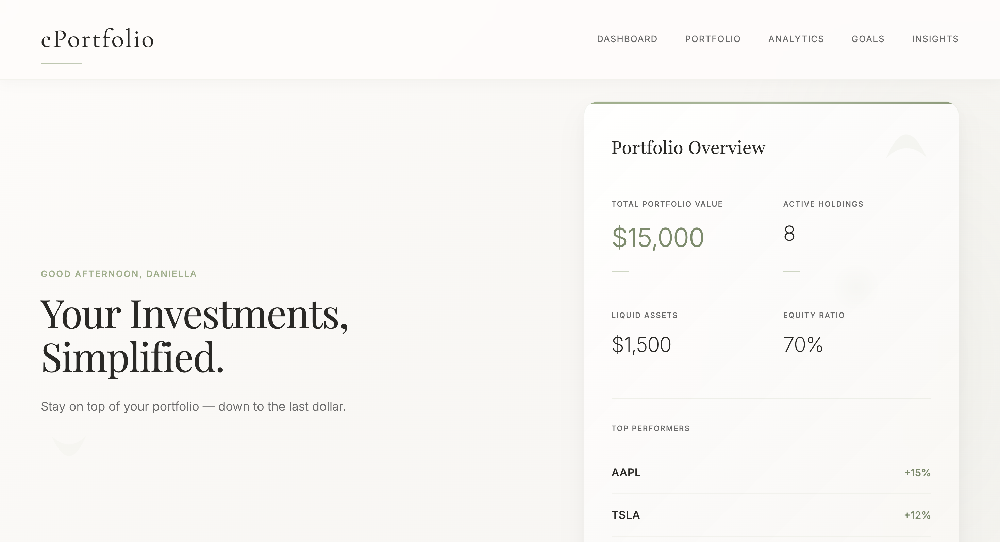

# ePortfolio – Investment Management Application

**This project showcases my ability to modernize legacy systems by replacing Java Swing interfaces with a modern, web-based frontend using HTML, CSS, and JavaScript, all powered by a Spring Boot backend.**

## Description

**ePortfolio** is an investment management application that allows users to manage their investments with ease. Initially developed as a **Java Swing GUI** for a school assignment, the project has been modernized with a clean **HTML/CSS/JavaScript** frontend for an enhanced user experience and includes additional functionalities. Now deployed live on Render.

---
Visit the deployed version on [Render](https://eportfolio-7hlr.onrender.com/) 


---

## Features

- **Buy Investments**: Add stocks or mutual funds to your portfolio.
- **Sell Investments**: Remove or reduce holdings.
- **Update Prices**: Update prices for existing investments.
- **View Gains**: View total and individual investment gains.
- **Search Portfolio**: Find investments by symbol, name, or price range.
- **Set Financial Goals**: Track progress toward savings milestones.
- **Interactive UI**: Smooth modals, progress bars, and confirmation messages.

---

## Technologies Used

### Frontend
- **HTML5**
- **CSS3**
- **Vanilla JavaScript**

### Backend
- **Java 17**
- **Spring Boot**
- **Maven**

### Tools & Deployment
- **Docker**
- **Render (PaaS deployment)**
- **RESTful APIs**
- **Cross-Origin Resource Sharing (CORS)**

---

## Future Enhancements

- **Authentication**: Add user login and registration.
- **Persistent Storage**: Integrate a database for saving portfolio data.
- **Real-Time Updates**: Fetch live market data.

---

## How to Run the Project Locally
If you'd like to see this project in action, please follow the steps below to run it locally on your machine:

### 1. **Clone the Repository**
First, clone the repository with: 

```git clone https://github.com/DaniellaToth05/ePortfolio2430.git```

Then, navigate into the project directory:
```cd ePortfolio2430/backend/demo```

### 2. **Build the Backend with Maven**
```./mvnw clean package -DskipTests```

### 3. ** Run the Spring Boot Application**
Start the development server with the following command:
```java -jar target/demo-0.0.1-SNAPSHOT.jar```

### 4. **View the Project**
Once the server is running, open your browser and go to

```http://localhost:8080```

You should see the **ePortfolio** dashboard, which allows you to interact with the project’s functionalities.

### 5. **Stop the Server**
When you're finished, stop the development server by pressing
```Ctrl + C```

---

## 📁 Project Structure

```bash
ePortfolio2430/
├── static/                 # Frontend assets (HTML, CSS, JS)
├── src/main/java/          # Spring Boot controllers and logic
├── Dockerfile              # Docker setup
├── pom.xml                 # Maven project config
└── README.md
```
---

Thank you for taking the time to view my project!

---

## Author

**Daniella Toth**  
*Software Engineering Student at University of Guelph*  
**Connect with Me**
*[LinkedIn](https://www.linkedin.com/in/daniella-toth-x03/)*

